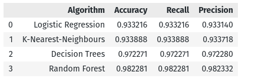

# About the Project

This project is built on the Stellar Classification dataset which classifies the stars based on their spectral characteristics. This project aims to build a supervised machine learning classification model to classifiy the output class based on the input spectral characteristics.

## About the Dataset
In astronomy, stellar classification is the classification of stars based on their spectral characteristics. The classification scheme of galaxies, quasars, and stars is one of the most fundamental in astronomy. The early cataloguing of stars and their distribution in the sky has led to the understanding that they make up our own galaxy and, following the distinction that Andromeda was a separate galaxy to our own, numerous galaxies began to be surveyed as more powerful telescopes were built. This datasat aims to classificate stars, galaxies, and quasars based on their spectral characteristics.

Dataset Link: https://www.kaggle.com/datasets/fedesoriano/stellar-classification-dataset-sdss17

## Machine Learning Algorithms Used
In this project, we implemented 4 different types of machine learning models for classification purpose. They include

1. Logistic Regression
2. K-Nearest Neighbours
3. Decision Trees
4. Random Forest

## Results
We compared all the 4 machine learning models and concluded that the Random forest algorithm for classification surpassed all other alogrithms for the particular given dataset.

